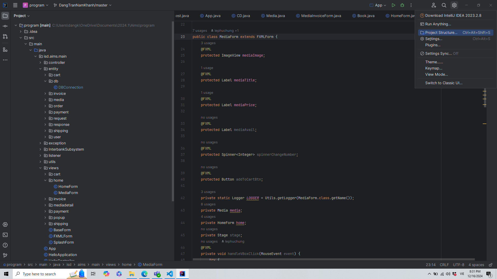

# Danh sách thành viên và nhiệm vụ
1. Vũ Đức Mạnh - 20215282 (Nhóm trường) - Xử lý logic
2. Lê Phúc Hưng - 20215276 - Thiết kế UI
3. Đặng Trần Nam Khánh - 20215278 - Xử lý logic
4. Ngô Đức Quang Anh - 20215259 - Thiết kế UI
5. Phan Huy Hiệp - 20210328 - Xử lý logic

# Use Case

# Hướng dẫn chạy code
1. Danh sách các công nghệ sử dụng:
* Mysql Workbench 
* Intellij IDE 
* Java 

2. Hướng dẫn cài đặt:
* Tải Mysql Workbench (Link download: https://dev.mysql.com/downloads/workbench/)
* Tải IDE Intellij (Link download: https://www.jetbrains.com/idea/download/?section=windows)
* Tải Mysql Connector, lưu ý chọn "Platform Independent" (Link download: https://dev.mysql.com/downloads/connector/j/)

3. Hướng dẫn chạy chương trình:
* Đầu tiên, bạn hãy tải mã nguồn của chương trình rồi giải nén.
* Tiếp theo, mở ứng dụng Intellij, chọn "open" rồi chọn folder "program" của chương trình bạn vừa giải nén
* Tiếp theo, để kết nối chương trình với Mysql, bạn cần giải nén file zip Mysql Connector vừa mới tải về. Sau khi đã giải nén, bạn quay trở lại Intellij rồi chọn Project Structure

* Chọn Libraries, rồi chọn dấu "+" (New project libraries), chọn file mysql-connector-j-version.jar mà bạn vừa giải nén. Chọn "OK"
* Tiếp theo, bạn cần cài đặt Mysql (Video hướng dẫn cài đặt: https://www.youtube.com/watch?v=hiS_mWZmmI0)
* Sau khi đã cài đặt xong Mysql, hãy mở ứng dụng lên, chọn "File", rồi chọn "Open SQL script", cuối cùng hãy chọn file "aims_sqlite.sql" trong folder assest.db và tạo CSDL 
* Cuối cùng, hãy quay trở lại Intellij, chạy file App.java 